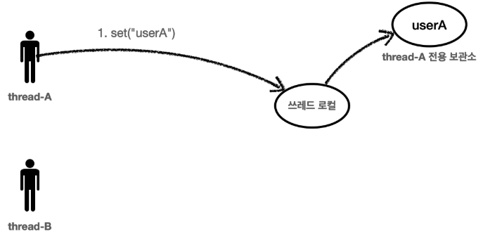
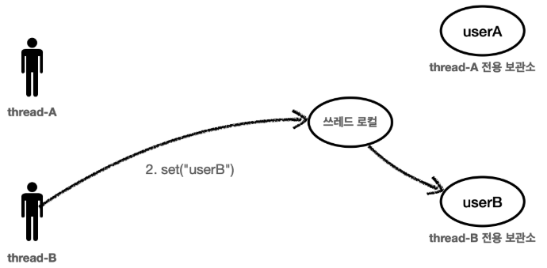
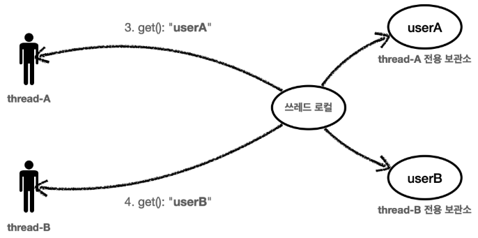

# ThreadLocal - 소개
쓰레드 로컬은 해당 쓰레드만 접근할 수 있는 특별한 저장소를 말한다.<br>
쉽게 이야기해서 물건 보관 창구를 떠올리면 된다. 여러 사람이 같은 물건 보관 창구를 사용하더라도 창구 직원은 사용자를 인식해서 사용자별로 확실하게 물건을 구분 해준다.<br>
사용자A, 사용자B 모두 창구 직원을 통해서 물건을 보관하고, 꺼내지만 창구 지원이 사용자에 따라 보관한 물건을 구분 해주는 것이다.

<br>

### 일반적인 변수 필드
여러 쓰레드가 같은 인스턴스의 필드에 접근하면 처음 쓰레드가 보관한 데이터가 사라질 수 있다.<br>
예를 들면 일반 변수 필드에 ```thread-A``` 가 ```userA``` 라는 값을 저장하고 ```thread-B``` 가 ```userB``` 라는 값을 저장하면 직전에 ```thread-A``` 가 저장한 ```userA``` 값은 사라진다.

<br>

### 쓰레드 로컬
쓰레드 로컬을 사용하면 각 쓰레드마다 별도의 내부 저장소를 제공한다.<br>
따라서 같은 인스턴스의 쓰레드 로컬 필드에 접근해도 문제 없다.



```thread-A``` 가 ```userA``` 라는 값을 저장하면 쓰레드 로컬은 ```thread-A``` 전용 보관소에 데이터를 안전하게 보관한다.

<br>



```thread-B``` 가 ```userB``` 라는 값을 저장하면 쓰레드 로컬은 ```thread-B``` 전용 보관소에 데이터를 안전하게 보관한다.

<br>



쓰레드 로컬을 통해서 데이터를 조회할 때도 ```thread-A``` 가 조회하면 쓰레드 로컬은 ```thread-A``` 전용 보관소에서 ```userA``` 데이터를 반환해준다.<br>
물론 ```thread-B``` 가 조회하면 ```thread-B``` 전용 보관소에서 ```userB``` 데이터를 반환해준다.

자바는 언어차원에서 쓰레드 로컬을 지원하기 위한 ```java.lang.ThreadLocal``` 클래스를 제공한다.