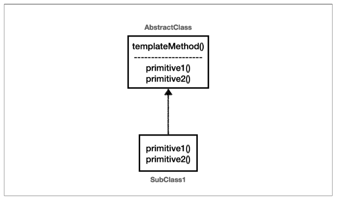

# 템플릿 메서드 패턴 - 정의
GOF 디자인 패턴에서는 템플릿 메서드 패턴을 다음과 같이 정의했다.

> 템플릿 메서드 디자인 패턴의 목적은 다음과 같습니다.<br>
> "작업에서 알고리즘의 골격을 정의하고 일부 단계를 하위 클래스로 연기합니다. 템플릿 메서드를 사용하면<br>
> 하위 클래스가 알고리즘의 구조를 변경하지 않고도 알고리즘의 특정 단계를 재정의할 수 있습니다." [GOF]

<br>

### GOF 템플릿 메서드 패턴 정의



풀어서 설명하면 다음과 같다.<br>
부모 클래스에 알고리즘의 골격인 템플릿을 정의하고, 일부 변경되는 로직은 자식 클래스에 정의하는 것이다.
이렇게 하면 자식 클래스가 알고리즘의 전체 구조를 변경하지 않고, 특정 부분만 재정의할 수 있다.
결국 상속과 오버라이딩을 통한 다형성으로 문제를 해결하는 것이다.

<br>

### 하지만
템플릿 메서드 패턴은 상속을 사용한다. 따라서 상속에서 오는 단점들을 그대로 안고간다.<br>
특히 자식 클래스가 부모 클래스와 컴파일 시점에 강하게 결합되는 문제가 있다. 이것은 의존관계에 대한 문제이다.
자식 클래스 입장에서는 부모 클래스의 기능을 전혀 사용하지 않는다.<br>
지금까지 작성했던 코드를 떠올려보자. 자식 클래스를 작성할 때 부모 클래스의 기능을 사용한 것이 있었던가?<br>
그럼에도 불구하고 템플릿 메서드 패턴을 위해 자식 클래스는 부모 클래스를 상속 받고 있다.

상속을 받는 다는 것은 특정 부모 클래스를 의존하고 있다는 것이다.<br>
자식 클래스의 ```extends``` 다음에 바로 부모 클래스가 코드상에 지정되어 있다. 따라서 부모 클래스의 기능을 사용하든 사용하지 않든 간에 부모 클래스를 강하게 의존하게 된다.
여기서 강하게 의존한다는 뜻은 자식 클래스의 코드에 부모 클래스의 코드가 명확하게 적혀 있다는 뜻이다.<br>
UML에서 상속을 받으면 삼각형 화살표가 ```자식 -> 부모``` 를 향하고 있는 것은 이런 의존관계를 반영하는 것이다.

자식 클래스 입장에서는 부모 클래스의 기능을 전혀 사용하지 않는데, 부모 클래스를 알아야한다.
이것은 좋은 설계가 아니다. 그리고 이런 잘못된 의존관계 때문에 부모 클래스를 수정하면, 자식 클래스에도 영향을 줄 수 있다.

추가로 템플릿 메서드 패턴은 상속 구조를 사용하기 때문에, 별도의 클래스나 익명 내부 클래스를 만들어야 하는 부분도 복잡하다.<br>
지금까지 설명한 이런 부분들을 더 깔끔하게 개선하려면 어떻게 해야할까?

템플릿 메서드 패턴과 비슷한 역할을 하면서 상속의 단점을 제거할 수 있는 디자인 패턴이 바로 ```전략 패턴(Strategy Pattern)```이다.