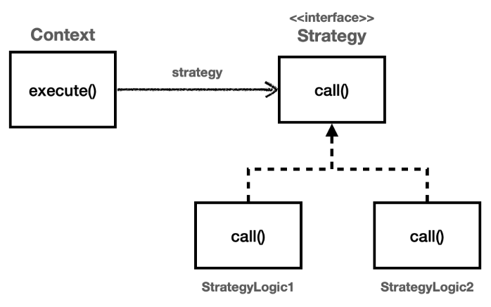
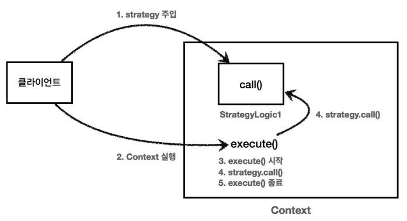

# 전략 패턴 - 예제 1

탬플릿 메서드 패턴은 부모 클래스에 변하지 않는 템플릿을 두고, 변하는 부분을 자식 클래스에 두어서 상속을 사용해서 문제를 해결했다.<br>
전략 패턴은 변하지 않는 부분을 ```Context```라는 곳에 두고, 변하는 부분을 ```Strategy```라는 인터페이스를 만들고 해당 인터페이스를 구현하도록 해서 문제를 해결한다.
상속이 아니라 위임으로 문제를 해결하는 것이다.<br>
전략 패턴에서 ```Context``` 는 변하지 않는 템플릿 역할을 하고, ```Strategy``` 는 변하는 알고리즘 역할을 한다.

GOF 디자인 패턴에서 정의한 전략 패턴의 의도는 다음과 같다.
> 알고리즘 제품군을 정의하고 각각을 캡슐화하여 상호 교환 가능하게 만들자.<br>
> 전략을 사용하면 알고리즘을 사용하는 클라이언트와 독립적으로 알고리즘을 변경할 수 있다.

<br>

### 예제 구성도



<br>

### 전략 패턴 실행 그림



1. ```Context``` 에 원하는 ```Strategy``` 구현체를 주입한다.
2. 클라이언트는 ```context``` 를 실행한다.
3. ```context``` 는 ```context``` 로직을 시작한다.
4. ```context``` 로직 중간에 ```strategy.call()``` 을 호출해서 주입 받은 ```strategy``` 로직을 실행한다.
5. ```context``` 는 나머지 로직을 실행한다.