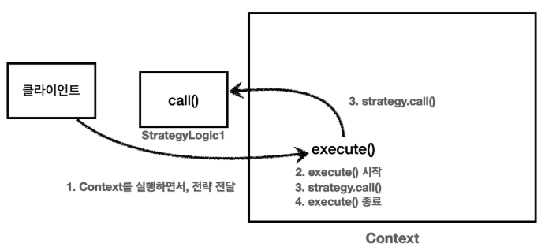

# 전략 패턴 - 예제 3

<br>

### 전략 패턴 파라미터 실행 그림



1. 클라이언트는 ```Context``` 를 실행하면서 인수로 ```Strategy``` 를 전달한다.
2. ```Context``` 는 ```execute()``` 로직을 실행한다.
3. ```Context``` 는 파라미터로 넘어온 ```strategy.call()``` 로직을 실행한다.
4. ```Context``` 의 ```execute()``` 로직이 종료된다.

<br>

### 정리
* ```ContextV1``` 은 필드에 ```Strategy``` 를 저장하는 방식으로 전략 패턴을 구사했다.
  * 선 조립, 후 실행 방법에 적합하다.
  * ```Context``` 를 실행하는 시점에는 이미 조립이 끝났기 때문에 전략을 신경쓰지 않고 단순히 실행만 하면 된다.
* ```ContextV2``` 는 파라미터에 ```Strategy``` 를 전달받는 방식으로 전략 패턴을 구사했다.
  * 실행할 때 마다 전략을 유연하게 변경할 수 있다.
  * 단점 역시 실행할 때 마다 전략을 계속 지정해주어야 한다는 점이다.

<br>

### 템플릿
지금 우리가 해결하고 싶은 문제는 변하는 부분과 변하지 않는 부분을 분리하는 것이다.<br>
변하지 않는 부분을 템플릿이라고 하고, 그 템플릿 안에서 변하는 부분에 약간 다른 코드 조각을 넘겨서 실행하는 것이 목적이다.<br>
```ContextV1``` , ```ContextV2``` 두 가지 방식 다 문제를 해결할 수 있지만, 어떤 방식이 조금 더 나아 보이는가?

지금 우리가 원하는 것은 애플리케이션 의존 관계를 설정하는 것 처럼 선 조립, 후 실행이 아니다.<br>
단순히 코드를 실행할 때 변하지 않는 템플릿이 있고, 그 템플릿 안에서 원하는 부분만 살짝 다른 코드를 실행하고 싶을 뿐이다.<br>
따라서 우리가 고민하는 문제는 실행 시점에 유연하게 실행 코드 조각을 전달하는 ```ContextV2``` 가 더 적합하다.

<br>

>디자인 패턴에서 가장 중요한 요소는 모양과 구성요소도 중요하지만 ```의도```가 가장 중요하다.