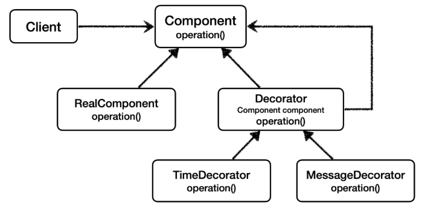

# 프록시 패턴과 데코레이터 패턴 정리

<br>

### GOF 데코레이터 패턴



여기서 생각해보면 ```Decorator``` 기능에 일부 중복이 있다. 꾸며주는 역할을 하는 ```Decorator``` 들은 스스로 존재할 수 없다.
항상 꾸며줄 대상이 있어야 한다. 따라서 내부에 호출 대상인 ```component``` 를 가지고 있어야 한다.<br>
그리고 ```component``` 를 항상 호출해야 한다. 이 부분이 중복이다.
이런 중복을 제거하기 위해 ```component``` 를 속성으로 가지고 있는 ```Decorator``` 라는 추상 클래스를 만드는 방법도 고민할 수 있다.
이렇게 하면 추가로 클래스 다이어그램에서 어떤 것이 실제 컴포넌트 인지, 데코레이터인지 명확하게 구분할 수 있다.
여기까지 고민한 것이 바로 GOF에서 설명하는 데코레이터 패턴의 기본 예제이다.

<br>

## 프록시 패턴 vs 데코레이터 패턴
여기까지 진행하면 몇가지 의문이 들 것이다.
* ```Decorator``` 라는 추상 클래스를 만들어야 데코레이터 패턴일까?
* 프록시 패턴과 데코레이터 패턴은 그 모양이 거의 비슷한 것 같은데?

<br>

### 의도(intent)
사실 프록시 패턴과 데코레이터 패턴은 그 모양이 거의 같고, 상황에 따라 정말 똑같을 때도 있다. 그러면 둘을 어떻게 구분하는 것일까?<br>
디자인 패턴에서 중요한 것은 해당 패턴의 겉모양이 아니라 그 패턴을 만든 의도가 더 중요하다. 따라서 의도에 따라 패턴을 구분한다.

* 프록시 패턴의 의도: 다른 개체에 대한 **접근을 제어** 하기 위해 대리자를 제공
* 데코레이터 패턴의 의도: **객체에 추가 책임(기능)을 동적으로 추가** 하고, 기능 확장을 위한 유연한 대안 제공

<br>

### 정리
프록시를 사용하고 해당 프록시가 접근 제어가 목적이라면 프록시 패턴이고, 새로운 기능을 추가하는 것이 목적이라면 데코레이터 패턴이 된다.