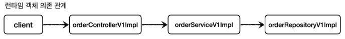

# 인터페이스 기반 프록시 - 적용
인터페이스와 구현체가 있는 V1 App에 지금까지 학습한 프록시를 도입해서 ```LogTrace```를 사용해보자.<br>
**"프록시를 사용하면 기존 코드를 전혀 수정하지 않고 로그 추적 기능을 도입할 수 있다."**

V1 App의 기본 클래스 의존 관계와 런타임시 객체 인스턴스 의존 관계는 다음과 같다.

<br>

### V1 기본 클래스 의존 관계


<br>

### V1 런타임 객체 의존 관계


<br>

**여기에 로그 추적용 프록시를 추가하면 다음과 같다.**

<br>

### V1 프록시 의존 관계 추가


```Controller``` , ```Service``` , ```Repository``` 각각 인터페이스에 맞는 프록시 구현체를 추가한다. (그림에서 리포지토리는 생략했다.)

<br>

### V1 프록시 런타임 객체 의존 관계


그리고 애플리케이션 실행 시점에 프록시를 사용하도록 의존 관계를 설정해주어야 한다.
이 부분은 빈을 등록하는 설정 파일을 활용하면 된다. (그림에서 리포지토리는 생략했다.)

<br>

## V1 프록시 런타임 객체 의존 관계 설정
* 이제 프록시의 런타임 객체 의존 관계를 설정하면 된다. 기존에는 스프링 빈이 ```orderControlerV1Impl```, ```orderServiceV1Impl``` 같은 실제 객체를 반환했다.
  하지만 이제는 프록시를 사용해야한다. 따라서 프록시를 생성하고 **프록시를 실제 스프링 빈 대신 등록한다. 실제 객체는 스프링 빈으로 등록하지 않는다.**
* 프록시는 내부에 실제 객체를 참조하고 있다. 예를 들어서 ```OrderServiceInterfaceProxy``` 는 내부에 실제 대상 객체인 ```OrderServiceV1Impl``` 을 가지고 있다.
* 정리하면 다음과 같은 의존 관계를 가지고 있다.
  * ```proxy -> target```
  * ```orderServiceInterfaceProxy -> orderServiceV1Impl```
* 스프링 빈으로 실제 객체 대신에 프록시 객체를 등록했기 때문에 앞으로 스프링 빈을 주입 받으면 **실제 객체 대신에 프록시 객체가 주입** 된다.
* 실제 객체가 스프링 빈으로 등록되지 않는다고 해서 사라지는 것은 아니다. 프록시 객체가 실제 객체를 참조하기 때문에 프록시를 통해서 실제 객체를 호출할 수 있다.
  쉽게 이야기해서 프록시 객체 안에 실제 객체가 있는 것이다.


```AppV1Config``` 를 통해 프록시를 적용하기 전
* 실제 객체가 스프링 빈으로 등록된다. 빈 객체의 마지막에 ```@x0..``` 라고 해둔 것은 인스턴스라는 뜻이다

<br>

### 스프링 컨테이너 - 프록시 적용 후


```InterfaceProxyConfig``` 를 통해 프록시를 적용한 후
* 스프링 컨테이너에 프록시 객체가 등록된다. 스프링 컨테이너는 이제 실제 객체가 아니라 프록시 객체를 스프링 빈으로 관리한다.
* 이제 실제 객체는 스프링 컨테이너와는 상관이 없다. 실제 객체는 프록시 객체를 통해서 참조될 뿐이다.
* 프록시 객체는 스프링 컨테이너가 관리하고 자바 힙 메모리에도 올라간다. 반면에 실제 객체는 자바 힙 메모리에는 올라가지만 스프링 컨테이너가 관리하지는 않는다.

<br>


최종적으로 이런 런타임 객체 의존관계가 발생한다. (리포지토리는 생략했다.)

<br>

## 정리
추가된 요구사항을 다시 확인해보자.

### 추가된 요구사항
* ~~원본 코드를 전혀 수정하지 않고, 로그 추적기를 적용해라.~~
* ~~특정 메서드는 로그를 출력하지 않는 기능~~
  * ~~보안상 일부는 로그를 출력하면 안된다.~~
* 다음과 같은 다양한 케이스에 적용할 수 있어야 한다.
  * ~~v1 - 인터페이스가 있는 구현 클래스에 적용~~
  * v2 - 인터페이스가 없는 구체 클래스에 적용
  * v3 - 컴포넌트 스캔 대상에 기능 적용

프록시와 DI 덕분에 원본 코드를 전혀 수정하지 않고, 로그 추적기를 도입할 수 있었다.
물론 너무 많은 프록시 클래스를 만들어야 하는 단점이 있기는 하다.
이 부분은 나중에 해결하기로 하고, 우선은 v2 - 인터페이스가 없는 구체 클래스에 프록시를 어떻게 적용할 수 있는지 알아보자.