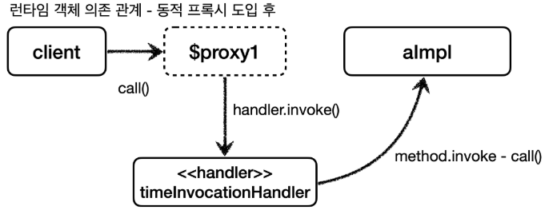
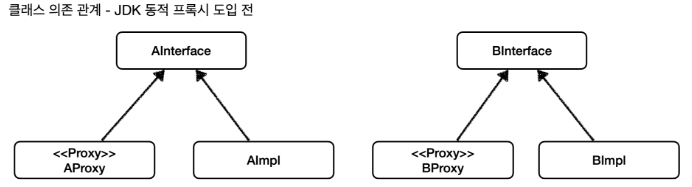
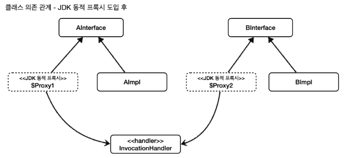
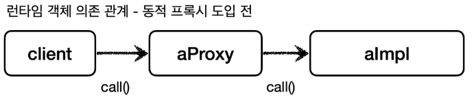
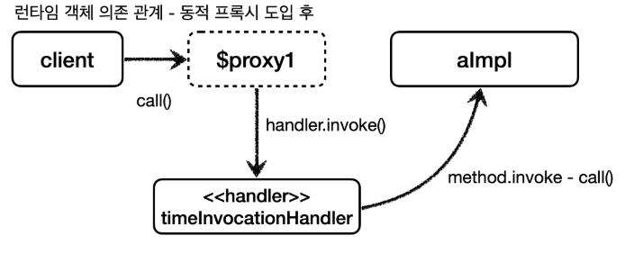

# JDK 동적 프록시 - 소개

지금까지 프록시를 적용하기 위해 적용 대상의 숫자 만큼 많은 프록시 클래스를 만들었다.
적용 대상이 100개면 프록시 클래스도 100개 만들었다.
그런데 앞서 살펴본 것과 같이 프록시 클래스의 기본 코드와 흐름은 거의 같고, 프록시를 어떤 대상에 적용하는가 정도만 차이가 있었다.
쉽게 이야기해서 프록시의 로직은 같은데, 적용 대상만 차이가 있는 것이다.

이 문제를 해결하는 것이 바로 동적 프록시 기술이다.<br>
동적 프록시 기술을 사용하면 개발자가 직접 프록시 클래스를 만들지 않아도 된다.
이름 그대로 프록시 객체를 동적으로 런타임에 개발자 대신 만들어준다.
그리고 동적 프록시에 원하는 실행 로직을 지정할 수 있다.

사실 동적 프록시는 말로는 이해하기 쉽지 않다. 바로 예제 코드를 보자.

> 주의<br>
>  JDK 동적 프록시는 인터페이스를 기반으로 프록시를 동적으로 만들어준다. 따라서 인터페이스가 필수이다.

먼저 자바 언어가 기본으로 제공하는 JDK 동적 프록시를 알아보자.

<br>

## 기본 예제 코드
JDK 동적 프록시를 이해하기 위해 아주 단순한 예제 코드를 만들어보자.<br>
간단히 A , B 클래스를 만드는데, JDK 동적 프록시는 인터페이스가 필수이다. 따라서 인터페이스와 구현체로 구분했다.

> [/src/test/java/thespeace/springAdvanced/jdkdynamic/code/AInterface.java](/src/test/java/thespeace/springAdvanced/jdkdynamic/code/AInterface.java)<br>
> [/src/test/java/thespeace/springAdvanced/jdkdynamic/code/AImpl.java](/src/test/java/thespeace/springAdvanced/jdkdynamic/code/AImpl.java)<br>
> [/src/test/java/thespeace/springAdvanced/jdkdynamic/code/BInterface.java](/src/test/java/thespeace/springAdvanced/jdkdynamic/code/BInterface.java)<br>
> [/src/test/java/thespeace/springAdvanced/jdkdynamic/code/BImpl.java](/src/test/java/thespeace/springAdvanced/jdkdynamic/code/BImpl.java)

<br>

# JDK 동적 프록시 - 예제 코드
## JDK 동적 프록시 InvocationHandler

JDK 동적 프록시에 적용할 로직은 ```InvocationHandler``` 인터페이스를 구현해서 작성하면 된다.<br><br><br>

#### JDK 동적 프록시가 제공하는 InvocationHandler
```java
package java.lang.reflect;

public interface InvocationHandler {
    public Object invoke(Object proxy, Method method, Object[] args) throws Throwable;
}
```

#### 제공되는 파라미터는 다음과 같다.
* ```Object proxy``` : 프록시 자신
* ```Method method``` : 호출한 메서드
* ```Object[] args``` : 메서드를 호출할 때 전달한 인수

이제 구현 코드를 보자.

> [/src/test/java/thespeace/springAdvanced/jdkdynamic/code/TimeInvocationHandler.java](/src/test/java/thespeace/springAdvanced/jdkdynamic/code/TimeInvocationHandler.java)<br>
> [/src/test/java/thespeace/springAdvanced/jdkdynamic/JdkDynamicProxyTest.java](/src/test/java/thespeace/springAdvanced/jdkdynamic/JdkDynamicProxyTest.java)

<br>

### 생성된 JDK 동적 프록시
실행 결과, ```proxyClass=class com.sun.proxy.$Proxy1``` 이 부분이 동적으로 생성된 프록시 클래스 정보이다.
이것은 우리가 만든 클래스가 아니라 JDK 동적 프록시가 이름 그대로 동적으로 만들어준 프록시이다.
이 프록시는 ```TimeInvocationHandler``` 로직을 실행한다.

<br>

### 실행 순서
1. 클라이언트는 JDK 동적 프록시의 ```call()``` 을 실행한다.
2. JDK 동적 프록시는 ```InvocationHandler.invoke()``` 를 호출한다. ```TimeInvocationHandler``` 가 구현체로 있으로 ```TimeInvocationHandler.invoke()``` 가 호출된다.
3. ```TimeInvocationHandler``` 가 내부 로직을 수행하고, ```method.invoke(target, args)``` 를 호출해서 ```target``` 인 실제 객체( ```AImpl``` )를 호출한다.
4. ```AImpl``` 인스턴스의 ```call()``` 이 실행된다.
5. ```AImpl``` 인스턴스의 ```call()``` 의 실행이 끝나면 ```TimeInvocationHandler``` 로 응답이 돌아온다.
   시간로그를 출력하고 결과를 반환한다.

<br>

### 실행 순서 그림



<br>

### 동적 프록시 클래스 정보
```dynamicA()``` 와 ```dynamicB()``` 둘을 동시에 함께 실행하면 JDK 동적 프록시가 각각 다른 동적 프록시 클래스를 만들어주는 것을 확인할 수 있다.

```
proxyClass=class com.sun.proxy.$Proxy1 //dynamicA
proxyClass=class com.sun.proxy.$Proxy2 //dynamicB
```

<br>

### 정리
예제를 보면 ```AImpl``` , ```BImpl``` 각각 프록시를 만들지 않았다.<br>
프록시는 JDK 동적 프록시를 사용해서 동적으로 만들고 ```TimeInvocationHandler``` 는 공통으로 사용했다.

JDK 동적 프록시 기술 덕분에 적용 대상 만큼 프록시 객체를 만들지 않아도 된다.<br>
그리고 같은 부가 기능 로직을 한번만 개발해서 공통으로 적용할 수 있다.<br>
만약 적용 대상이 100개여도 동적 프록시를 통해서 생성하고, 각각 필요한 ```InvocationHandler``` 만 만들어서 넣어주면 된다.<br>
결과적으로 프록시 클래스를 수 없이 만들어야 하는 문제도 해결하고, 부가 기능 로직도 하나의 클래스에 모아서 단일 책임 원칙(SRP)도 지킬 수 있게 되었다.<br>

JDK 동적 프록시 없이 직접 프록시를 만들어서 사용할 때와 JDK 동적 프록시를 사용할 때의 차이를 그림으로 비교해보자.

<br>

### JDK 동적 프록시 도입 전 - 직접 프록시 생성


<br>

### JDK 동적 프록시 도입 후


* 점선은 개발자가 직접 만드는 클래스가 아니다.

<br>

### JDK 동적 프록시 도입 전



<br>

### JDK 동적 프록시 도입 후



다음엔 지금까지 학습한 JDK 동적 프록시를 애플리케이션에 적용해보자.