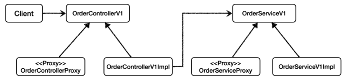
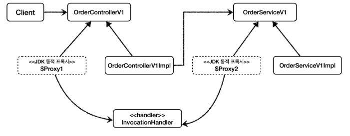
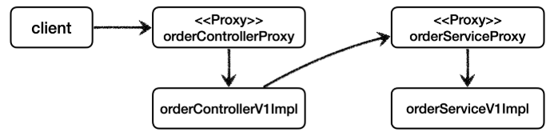
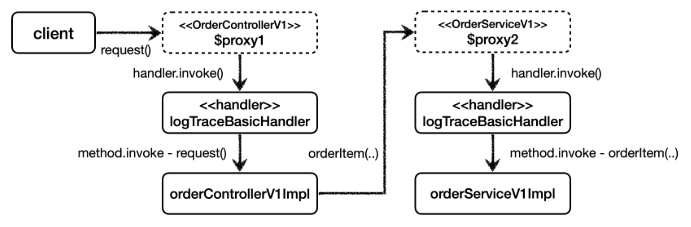

# JDK 동적 프록시 - 적용
## 그림으로 정리

<br>

### 클래스 의존 관계 - 직접 프록시 사용


<br>

### 클래스 의존 관계 - JDK 동적 프록시 사용


<br>

### 런타임 객체 의존 관계 - 직접 프록시 사용


<br>

### 런타임 객체 의존 관계 - JDK 동적 프록시 사용


<br>

## 남은 문제
* http://localhost:8080/proxy/v1/no-log
* ```no-log```를 실행해도 동적 프록시가 적용되고, ```LogTraceBasicHandler``` 가 실행되기 때문에 로그가 남는다.
  이 부분을 로그가 남지 않도록 처리해야 한다.