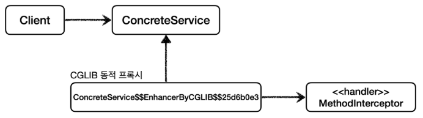
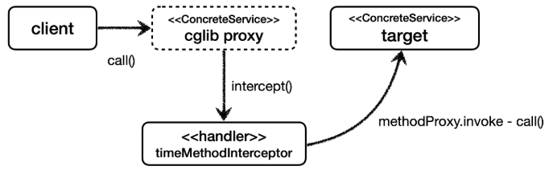

# CGLIB - 예제 코드

<br>

JDK 동적 프록시에서 실행 로직을 위해 ```InvocationHandler``` 를 제공했듯이, CGLIB는 ```MethodInterceptor```를 제공한다.

<br>

### MethodInterceptor -CGLIB 제공
```java
package org.springframework.cglib.proxy;

public interface MethodInterceptor extends Callback {
    Object intercept(Object obj, Method method, Object[] args, MethodProxy proxy) throws Throwable;
}
```
* ```obj``` : CGLIB가 적용된 객체
* ```method``` : 호출된 메서드
* ```args``` : 메서드를 호출하면서 전달된 인수
* ```proxy``` : 메서드 호출에 사용

> [/src/test/java/thespeace/springAdvanced/cglib/code/TimeMethodInterceptor.java](/src/test/java/thespeace/springAdvanced/cglib/code/TimeMethodInterceptor.java)<br>
> [/src/test/java/thespeace/springAdvanced/cglib/CglibTest.java](/src/test/java/thespeace/springAdvanced/cglib/CglibTest.java)

<br>

### CGLIB가 생성한 프록시 클래스 이름

CGLIB를 통해서 생성된 클래스의 이름을 확인해보자.<br>
```ConcreteService$$EnhancerByCGLIB$$25d6b0e3```

CGLIB가 동적으로 생성하는 클래스 이름은 다음과 같은 규칙으로 생성된다.<br>
```대상클래스$$EnhancerByCGLIB$$임의코드```

참고로 다음은 JDK Proxy가 생성한 클래스 이름이다.<br>
```proxyClass=class com.sun.proxy.$Proxy1```

<br>

## 그림으로 정리

### 클래스 의존 관계 - CGLIB



### 런타임 객체 의존 관계 - CGLIB



<br>

### CGLIB 제약
* 클래스 기반 프록시는 상속을 사용하기 때문에 몇가지 제약이 있다.
  * 부모 클래스의 생성자를 체크해야 한다. -> CGLIB는 자식 클래스를 동적으로 생성하기 때문에 기본 생성자가 필요하다.
  * 클래스에 ```final``` 키워드가 붙으면 상속이 불가능하다. -> CGLIB에서는 예외가 발생한다.
  * 메서드에 ```final``` 키워드가 붙으면 해당 메서드를 오버라이딩 할 수 없다. -> CGLIB에서는 프록시 로직이 동작하지 않는다.

<br>

> 참고<br>
> CGLIB를 사용하면 인터페이스가 없는 V2 애플리케이션에 동적 프록시를 적용할 수 있다.
> 그런데 지금 당장 적용하기에는 몇가지 제약이 있다. V2 애플리케이션에 기본 생성자를 추가하고, 의존관계를 setter 를 사용해서 주입하면 CGLIB를 적용할 수 있다.
> 하지만 다음에 학습하는 ProxyFactory 를 통해서 CGLIB를 적용하면 이런 단점을 해결하고 또 더 편리하기 때문에, 애플리케이션에 CGLIB로 프록시를 적용하는 것은 조금 뒤에 알아보겠다.

<br>

### 정리
남은 문제
* 인터페이스가 있는 경우에는 JDK 동적 프록시를 적용하고, 그렇지 않은 경우에는 CGLIB를 적용하려면 어떻게 해야할까?
* 두 기술을 함께 사용할 때 부가 기능을 제공하기 위해서 JDK 동적 프록시가 제공하는 ```InvocationHandler```와 CGLIB가 제공하는 ```MethodInterceptor``` 를 각각 중복으로 만들어서 관리해야 할까?
* 특정 조건에 맞을 때 프록시 로직을 적용하는 기능도 공통으로 제공되었으면?
* 다음에는 위의 의문점을 해결하기 위해 스프링이 지원하는 **프록시 팩토리** 에 대해 알아보자.