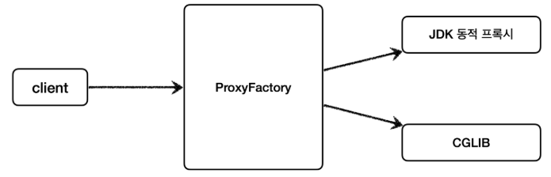
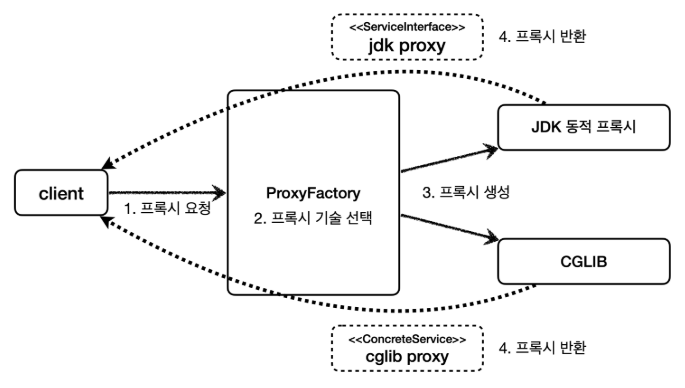
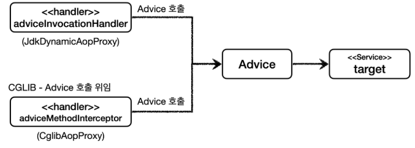
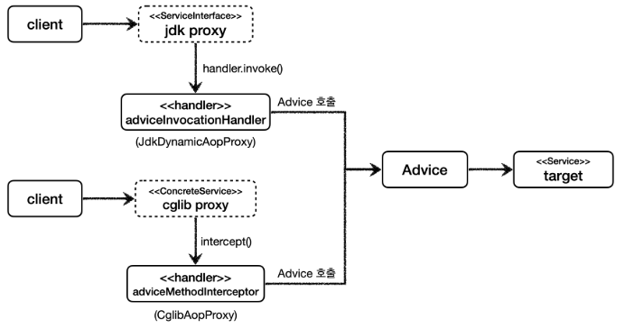

# 프록시 팩토리 - 소개
앞서 마지막에 설명했던 동적 프록시를 사용할 때 문제점을 다시 확인해보자.

<br>

### 문제점
* 인터페이스가 있는 경우에는 JDK 동적 프록시를 적용하고, 그렇지 않은 경우에는 CGLIB를 적용하려면 어떻게 해야할까?
* 두 기술을 함께 사용할 때 부가 기능을 제공하기 위해 JDK 동적 프록시가 제공하는 ```InvocationHandler``` 와 CGLIB가 제공하는 ```MethodInterceptor``` 를 각각 중복으로 만들어서 관리해야 할까?
* 특정 조건에 맞을 때 프록시 로직을 적용하는 기능도 공통으로 제공되었으면?

<br>

### Q.인터페이스가 있는 경우에는 JDK 동적 프록시를 적용하고, 그렇지 않은 경우에는 CGLIB를 적용하려면 어떻게 해야할까?
스프링은 유사한 구체적인 기술들이 있을 때, 그것들을 통합해서 일관성 있게 접근할 수 있고, 더욱 편리하게 사용할 수 있는 추상화된 기술을 제공한다.<br>
스프링은 동적 프록시를 통합해서 편리하게 만들어주는 프록시 팩토리( ```ProxyFactory``` )라는 기능을 제공한다.<br>
이전에는 상황에 따라서 JDK 동적 프록시를 사용하거나 CGLIB를 사용해야 했다면, 이제는 이 프록시 팩토리 하나로 편리하게 동적 프록시를 생성할 수 있다.<br>
프록시 팩토리는 인터페이스가 있으면 JDK 동적 프록시를 사용하고, 구체 클래스만 있다면 CGLIB를 사용한다. 그리고 이 설정을 변경할 수도 있다.

<br>

## 프록시 팩토리
### 프록시 팩토리 - 의존 관계


<br>

### 프록시 팩토리 - 사용 흐름


<br>

### Q: 두 기술을 함께 사용할 때 부가 기능을 적용하기 위해 JDK 동적 프록시가 제공하는 ```InvocationHandler```와 CGLIB가 제공하는 ```MethodInterceptor```를 각각 중복으로 따로 만들어야 할까?

스프링은 이 문제를 해결하기 위해 부가 기능을 적용할 때 Advice 라는 새로운 개념을 도입했다.<br>
개발자는 ```InvocationHandler``` 나 ```MethodInterceptor``` 를 신경쓰지 않고, ```Advice``` 만 만들면 된다.<br>
결과적으로 ```InvocationHandler``` 나 ```MethodInterceptor``` 는 ```Advice``` 를 호출하게 된다.<br>
프록시 팩토리를 사용하면 ```Advice``` 를 호출하는 전용 ```InvocationHandler``` , ```MethodInterceptor``` 를 내부에서 사용한다.

<br>

## Advice 도입
### JDK 동적 프록시 - Advice 호출 위임


<br>

### Advice 도입 - 전체 흐름


개발자 입장에서 간단하게 생각하자면, 프록시를 생성하는 건 ```프록시 팩토리```로 그 다음에 로직은 ```Advice```를 사용한다고 생각하며 된다.

<br>

### Q: 특정 조건에 맞을 때 프록시 로직을 적용하는 기능도 공통으로 제공되었으면?

앞서 특정 메서드 이름의 조건에 맞을 때만 프록시 부가 기능이 적용되는 코드를 직접 만들었다.<br>
스프링은 ```Pointcut```이라는 개념을 도입해서 이 문제를 일관성 있게 해결한다.