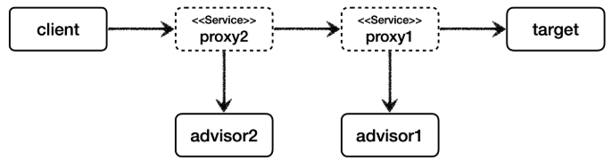

# 여러 어드바이저 함께 적용 - 예제 코드4

어드바이저는 하나의 포인트컷과 하나의 어드바이스를 가지고 있다.<br>
만약 여러 어드바이저를 하나의 target 에 적용하려면 어떻게 해야할까?<br>
쉽게 이야기해서 하나의 target 에 여러 어드바이스를 적용하려면 어떻게 해야할까?<br>

지금 떠오르는 방법은 프록시를 여러게 만들면 될 것 같다.

<br>

## 여러 프록시 사용



포인트컷은 ```advisor1``` , ```advisor2``` 모두 항상 ```true``` 를 반환하도록 설정했다. 따라서 둘다 어드바이스가 적용된다.

<br>

### 여러 프록시의 문제
이 방법이 잘못된 것은 아니지만, 프록시를 2번 생성해야 한다는 문제가 있다. 만약 적용해야 하는 어드바이저가 10개라면 10개의 프록시를 생성해야한다.

<br>

### 하나의 프록시, 여러 어드바이저
스프링은 이 문제를 해결하기 위해 하나의 프록시에 여러 어드바이저를 적용할 수 있게 만들어두었다.

<br>

## 프록시 팩토리 - 여러 어드바이저 적용 가능


<br>

### 정리
결과적으로 여러 프록시를 사용할 때와 비교해서 결과는 같고, 성능은 더 좋다.

<br>

> 중요<br>
> 사실 이번 장을 이렇게 풀어서 설명한 이유가 있다. 스프링의 AOP를 처음 공부하거나 사용하면, AOP 적용 수 만큼 프록시가 생성된다고 착각하게 된다.<br>
> 실제 많은 실무 개발자들도 이렇게 생각하는 것을 보았다.<br>
> 스프링은 AOP를 적용할 때, 최적화를 진행해서 지금처럼 프록시는 하나만 만들고, 하나의 프록시에 여러 어드바이저를 적용한다.<br>
> 정리하면 하나의 target 에 여러 AOP가 동시에 적용되어도, 스프링의 AOP는 target 마다 하나의 프록시만 생성한다. 이부분을 꼭 기억해두자.
