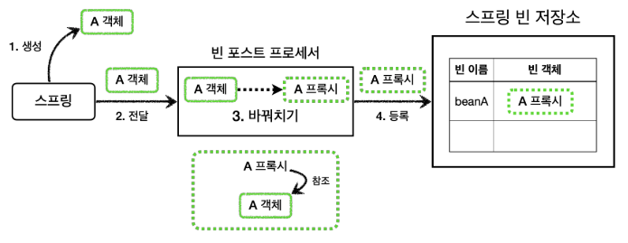

# 빈 후처리기 - 적용
빈 후처리기를 사용해서 실제 객체 대신 프록시를 스프링 빈으로 등록해보자.<br>
이렇게 하면 수동으로 등록하는 빈은 물론이고, 컴포넌트 스캔을 사용하는 빈까지 모두 프록시를 적용할 수 있다.<br>
더 나아가서 설정 파일에 있는 수 많은 프록시 생성 코드도 한번에 제거할 수 있다.

<br>

### 빈 후처리기 - 프록시 적용


> 코드<br>
> /thespeace/springAdvanced/proxy/config/v4_postprocessor/postprocessor/PackageLogTraceProxyPostProcessor.java<br>
> /thespeace/springAdvanced/proxy/config/v4_postprocessor/BeanPostProcessorConfig.java

<br>

### 애플리케이션 로딩 로그
중요 부분만 남기고 순서를 조정하고 축약했다.
```
#v1 애플리케이션 프록시 생성 - JDK 동적 프록시
create proxy: target=v1.OrderRepositoryV1Impl proxy=class com.sun.proxy.$Proxy50
create proxy: target=v1.OrderServiceV1Impl proxy=class com.sun.proxy.$Proxy51
create proxy: target=v1.OrderControllerV1Impl proxy=class com.sun.proxy.$Proxy52
#v2 애플리케이션 프록시 생성 - CGLIB
create proxy: target=v2.OrderRepositoryV2 proxy=v2.OrderRepositoryV2$
$EnhancerBySpringCGLIB$$x4
create proxy: target=v2.OrderServiceV2 proxy=v2.OrderServiceV2$
$EnhancerBySpringCGLIB$$x5
create proxy: target=v2.OrderControllerV2 proxy=v2.OrderControllerV2$
$EnhancerBySpringCGLIB$$x6
#v3 애플리케이션 프록시 생성 - CGLIB
create proxy: target=v3.OrderRepositoryV3 proxy=3.OrderRepositoryV3$
$EnhancerBySpringCGLIB$$x1
create proxy: target=v3.orderServiceV3 proxy=3.OrderServiceV3$
$EnhancerBySpringCGLIB$$x2
create proxy: target=v3.orderControllerV3 proxy=3.orderControllerV3$
$EnhancerBySpringCGLIB$$x3
```

* 여기서는 생략했지만, 실행해보면 스프링 부트가 기본으로 등록하는 수 많은 빈들이 빈 후처리기를 통과하는 것을 확인할 수 있다.<br>
  여기에 모두 프록시를 적용하는 것은 올바르지 않다. 꼭 필요한 곳에만 프록시를 적용해야 한다.<br>
  여기서는 ```basePackage``` 를 사용해서 v1~v3 애플리케이션 관련 빈들만 프록시 적용 대상이 되도록 했다.
* **v1** : 인터페이스가 있으므로 JDK 동적 프록시가 적용된다.
* **v2** : 구체 클래스만 있으므로 CGLIB 프록시가 적용된다.
* **v3** : 구체 클래스만 있으므로 CGLIB 프록시가 적용된다.

<br>

### 컴포넌트 스캔에도 적용
여기서 중요한 포인트는 v1, v2와 같이 수동으로 등록한 빈 뿐만 아니라 컴포넌트 스캔을 통해 등록한 v3 빈들도 프록시를 적용할 수 있다는 점이다. 이것은 모두 빈 후처리기 덕분이다.

<br>

### 프록시 적용 대상 여부 체크
* 애플리케이션을 실행해서 로그를 확인해보면 알겠지만, 우리가 직접 등록한 스프링 빈들 뿐만 아니라 스프링 부트가 기본으로 등록하는 수 많은 빈들이 빈 후처리기에 넘어온다.<br>
  그래서 어떤 빈을 프록시로 만들 것인지 기준이 필요하다. 여기서는 간단히 ```basePackage``` 를 사용해서 특정 패키지를 기준으로 해당 패키지와 그 하위 패키지의 빈들을 프록시로 만든다.
* 스프링 부트가 기본으로 제공하는 빈 중에는 프록시 객체를 만들 수 없는 빈들도 있다. 따라서 모든 객체를 프록시로 만들 경우 오류가 발생한다.