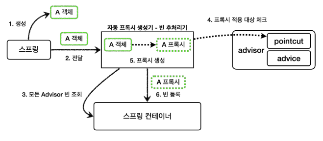
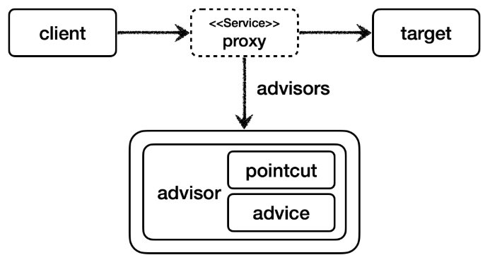

# 스프링이 제공하는 빈 후처리기 1

주의 - 다음을 꼭 추가해주어야 한다.

### build.gradle - 추가
```
implementation 'org.springframework.boot:spring-boot-starter-aop'
```

이 라이브러리를 추가하면 ```aspectjweaver``` 라는 ```aspectJ``` 관련 라이브러리를 등록하고, 스프링 부트가 AOP 관련 클래스를 자동으로 스프링 빈에 등록한다.
스프링 부트가 없던 시절에는 ```@EnableAspectJAutoProxy``` 를 직접 사용해야 했는데, 이 부분을 스프링 부트가 자동으로 처리해준다.
```aspectJ``` 는 뒤에서 설명한다. 스프링 부트가 활성화하는 빈은 ```AopAutoConfiguration``` 를 참고하자.

<br>

## 자동 프록시 생성기 - AutoProxyCreator
* 앞서 이야기한 스프링 부트 자동 설정으로 ```AnnotationAwareAspectJAutoProxyCreator``` 라는 빈 후처리기가 스프링 빈에 자동으로 등록된다.
* 이름 그대로 자동으로 프록시를 생성해주는 빈 후처리기이다.
* 이 빈 후처리기는 스프링 빈으로 등록된 ```Advisor``` 들을 자동으로 찾아서 프록시가 필요한 곳에 자동으로 프록시를 적용해준다.
* ```Advisor``` 안에는 ```Pointcut``` 과 ```Advice``` 가 이미 모두 포함되어 있다.
  따라서 ```Advisor``` 만 알고 있으면 그 안에 있는 ```Pointcut``` 으로 어떤 스프링 빈에 프록시를 적용해야 할지 알 수 있다.
  그리고 ```Advice``` 로 부가 기능을 적용하면 된다.

<br>

> 참고<br>
> ```AnnotationAwareAspectJAutoProxyCreator``` 는 @AspectJ와 관련된 AOP 기능도 자동으로 찾아서 처리해준다.<br>
> ```Advisor``` 는 물론이고, ```@Aspect``` 도 자동으로 인식해서 프록시를 만들고 AOP를 적용해준다. ```@Aspect```은 나중에 알아보자.

<br>

## 자동 프록시 생성기의 작동 과정 - 그림



### 자동 프록시 생성기의 작동 과정을 알아보자.

1. 생성: 스프링이 스프링 빈 대상이 되는 객체를 생성한다. ( ```@Bean``` , 컴포넌트 스캔 모두 포함)
2. 전달: 생성된 객체를 빈 저장소에 등록하기 직전에 빈 후처리기에 전달한다.
3. 모든 Advisor 빈 조회: 자동 프록시 생성기 - 빈 후처리기는 스프링 컨테이너에서 모든 ```Advisor``` 를 조회한다.
4. 프록시 적용 대상 체크: 앞서 조회한 ```Advisor``` 에 포함되어 있는 포인트컷을 사용해서 해당 객체가 프록시를
   적용할 대상인지 아닌지 판단한다. 이때 객체의 클래스 정보는 물론이고, 해당 객체의 모든 메서드를 포인트컷에
   하나하나 모두 매칭해본다. 그래서 조건이 하나라도 만족하면 프록시 적용 대상이 된다. 예를 들어서 10개의 메서드
   중에 하나만 포인트컷 조건에 만족해도 프록시 적용 대상이 된다.
5. 프록시 생성: 프록시 적용 대상이면 프록시를 생성하고 반환해서 프록시를 스프링 빈으로 등록한다.
   만약 프록시 적용 대상이 아니라면 원본 객체를 반환해서 원본 객체를 스프링 빈으로 등록한다.
6. 빈 등록: 반환된 객체는 스프링 빈으로 등록된다.

<br>

## 생성된 프록시



프록시는 내부에 어드바이저와 실제 호출해야할 대상 객체( ```target``` )을 알고 있다.

코드를 통해 바로 적용해보자.

<br>

> 코드<br>
> /thespeace/springAdvanced/proxy/config/v5_autoproxy/AutoProxyConfig.java

<br>

## 중요 : 포인트컷은 2가지에 사용된다.

1. 프록시 적용 여부 판단 - 생성 단계
   * 자동 프록시 생성기는 포인트컷을 사용해서 해당 빈이 프록시를 생성할 필요가 있는지 없는지 체크한다.
   * 클래스 + 메서드 조건을 모두 비교한다. 이때 모든 메서드를 체크하는데, 포인트컷 조건에 하나하나 매칭해본다.
     만약 조건에 맞는 것이 하나라도 있으면 프록시를 생성한다.
     * 예) ```orderControllerV1``` 은 ```request()``` , ```noLog()``` 가 있다. 여기에서 ```request()``` 가 조건에 만족하므로 프록시를 생성한다.
   * 만약 조건에 맞는 것이 하나도 없으면 프록시를 생성할 필요가 없으므로 프록시를 생성하지 않는다.
2. 어드바이스 적용 여부 판단 - 사용 단계
   * 프록시가 호출되었을 때 부가 기능인 어드바이스를 적용할지 말지 포인트컷을 보고 판단한다.
   * 앞서 설명한 예에서 ```orderControllerV1``` 은 이미 프록시가 걸려있다
   * ```orderControllerV1``` 의 ```request()``` 는 현재 포인트컷 조건에 만족하므로 프록시는 어드바이스를 먼저 호출하고, ```target``` 을 호출한다.
   * ```orderControllerV1``` 의 ```noLog()``` 는 현재 포인트컷 조건에 만족하지 않으므로 어드바이스를 호출하지 않고 바로 ```target``` 만 호출한다.

<br>

> 참고<br>
> 프록시를 모든 곳에 생성하는 것은 비용 낭비이다. 꼭 필요한 곳에 최소한의 프록시를 적용해야 한다.<br>
> 그래서 자동 프록시 생성기는 모든 스프링 빈에 프록시를 적용하는 것이 아니라 포인트컷으로 한번 필터링해서 어드바이스가 사용될 가능성이 있는 곳에만 프록시를 생성한다.