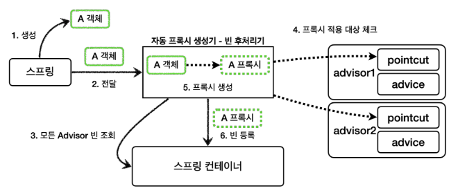
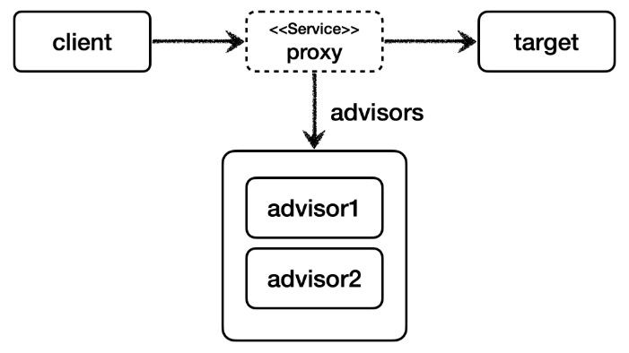

# 하나의 프록시, 여러 Advisor 적용
예를 들어서 어떤 스프링 빈이 ```advisor1``` , ```advisor2``` 가 제공하는 포인트컷의 조건을 모두 만족하면 프록시 자동 생성기는 프록시를 몇 개 생성할까?<br>
프록시 자동 생성기는 프록시를 하나만 생성한다. 왜냐하면 프록시 팩토리가 생성하는 프록시는 내부에 여러 ```advisor``` 들을 포함할 수 있기 때문이다.<br>
따라서 프록시를 여러 개 생성해서 비용을 낭비할 이유가 없다.

<br>

### 프록시 자동 생성기 상황별 정리
* ```advisor1``` 의 포인트컷만 만족 -> 프록시1개 생성, 프록시에 ```advisor1``` 만 포함
* ```advisor1``` , ```advisor2``` 의 포인트컷을 모두 만족 프록시1개 생성, 프록시에 ```advisor1``` , ```advisor2``` 모두 포함
* ```advisor1``` , ```advisor2``` 의 포인트컷을 모두 만족하지 않음 프록시가 생성되지 않음

**스프링 AOP도 동일한 방식으로 동작한다.**

<br>

### 자동 프록시 생성기



<br>

### 하나의 프록시, 여러 어드바이저



<br>

## 정리
자동 프록시 생성기인 ```AnnotationAwareAspectJAutoProxyCreator``` 덕분에 개발자는 매우 편리하게 프록시를 적용할 수 있다.
이제 ```Advisor``` 만 스프링 빈으로 등록하면 된다.

```Advisor = Pointcut + Advice```

또한 ```@Aspect``` 애노테이션을 사용해서 더 편리하게 포인트컷과 어드바이스를 만들고 프록시를 적용할 수 있다.